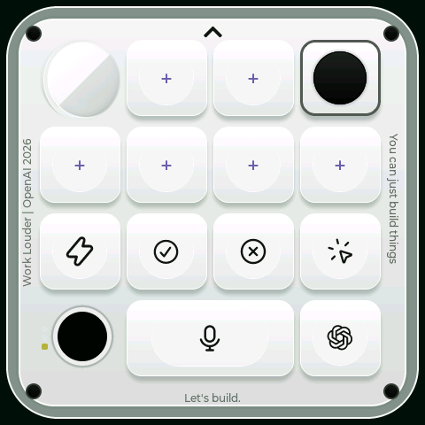

# codex-micro-waveshare

面向 **Waveshare ESP32-S3-Touch-LCD-4B** 的非官方 Codex Micro 兼容项目，由 Jhckevin 维护。



项目分为三部分：

- [`firmware/`](firmware/)：ESP32-S3 嵌入式固件、触摸界面、BLE/USB 通信、灯效与电源管理。
- [`desktop/`](desktop/)：Windows 管理客户端，负责分层、键帽、按键映射和设备配置。
- [`hardware/`](hardware/)：扩展底座与装配资料；模型和最终尺寸将在后续补充。

## 硬件

只面向 **ESP32-S3-Touch-LCD-4B**，不要用于名称相近的其他微雪屏幕。

- [微雪官方 Wiki：ESP32-S3-Touch-LCD-4B](https://www.waveshare.net/wiki/ESP32-S3-Touch-LCD-4B)
- [完整中文使用、自行构建与故障排查手册](docs/USER_GUIDE.zh-CN.md)

电池配置针对 **606080、ATL A 类电芯、3.7 V、4000 mAh / 14.8 Wh、带保护板**。本项目将 AXP2101 的软件充电上限限制为 **1.2 A**。不同电池必须先降低配置并按自身规格验证。AXP2101 的芯片上限随截止电压而变化；4.2 V 档手册上限为 1.4 A，并非所有条件均为 1.5 A。

## 当前版本的加密状态

**当前公开源码版本已经关闭加密套件。** 默认构建不启用 Secure Boot、Flash Encryption、eFuse 写入、设备唯一绑定、激活校验或私有公网更新鉴权；用户可以自行编译、烧录、修改或完全替换固件。

这里的“关闭”只描述本仓库的默认配置，**不会撤销某颗芯片此前已经烧写的 eFuse**。如果开发板曾启用 Secure Boot 或 Flash Encryption，请先核对该芯片的真实 eFuse 状态，不要直接假定普通未加密镜像可以启动。

## 自行构建

仓库只提供源码，不提供 Release、固件镜像、安装包或 portable 文件。

固件使用 ESP-IDF 5.4.2：

```sh
cd firmware
idf.py set-target esp32s3
idf.py build
idf.py -p YOUR_UART_PORT flash monitor
```

Windows 客户端使用 Node.js 24：

```powershell
cd desktop
npm ci
powershell -ExecutionPolicy Bypass -File native/build.ps1
npm test
npm run build
```

具体环境、双 USB 口、BOOT 恢复、配对、客户端打包和测试步骤请阅读完整手册。

## 平台与状态

固件主要在 Windows 主机上开发和实机验证；macOS 仅做兼容性设计，尚未实机验证。桌面客户端目前只支持 Windows。加密与 eFuse 默认状态见上方“当前版本的加密状态”；源码版不预置私有公网更新域名。

这是独立社区项目，不代表 OpenAI、Work Louder 或 Waveshare 官方支持。协议和宿主应用更新可能影响兼容性。

## 许可

项目代码使用 MIT License；第三方组件、名称、图标和素材仍遵循各自许可与权利声明。参见 [`LICENSE`](LICENSE) 和 [`firmware/NOTICE.md`](firmware/NOTICE.md)。
