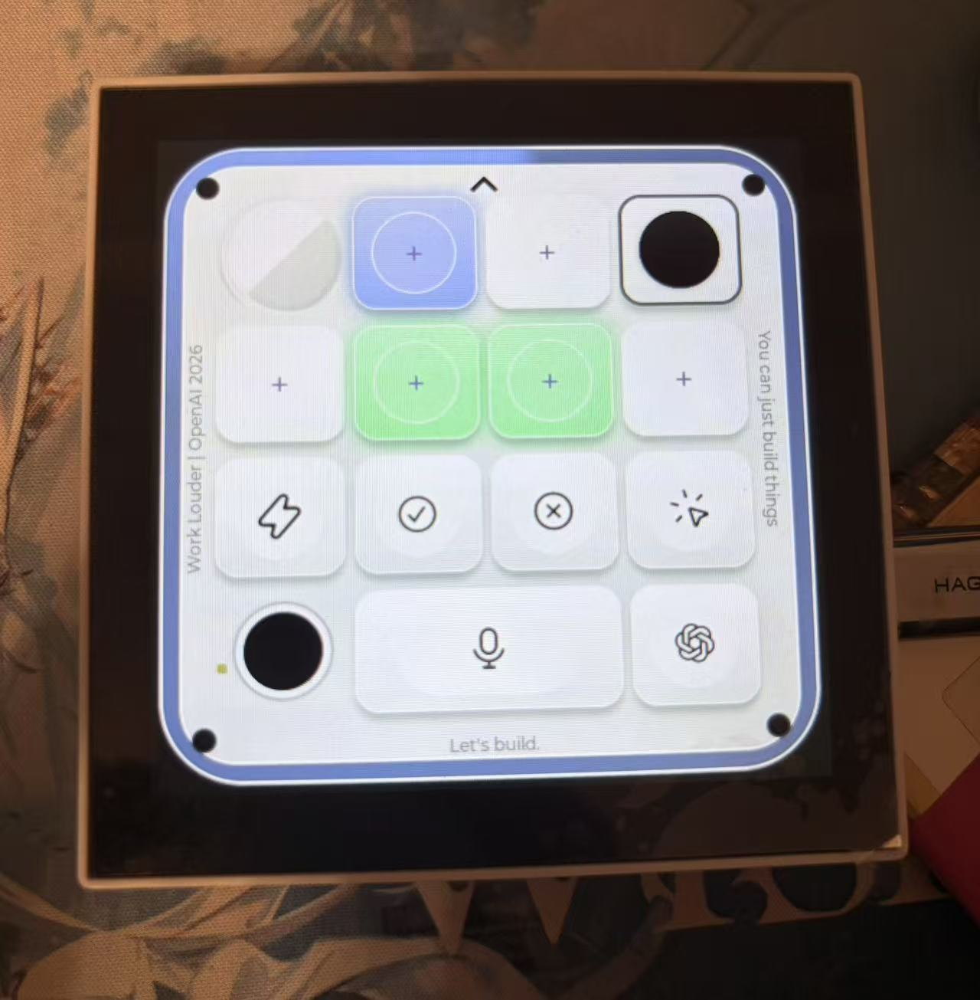
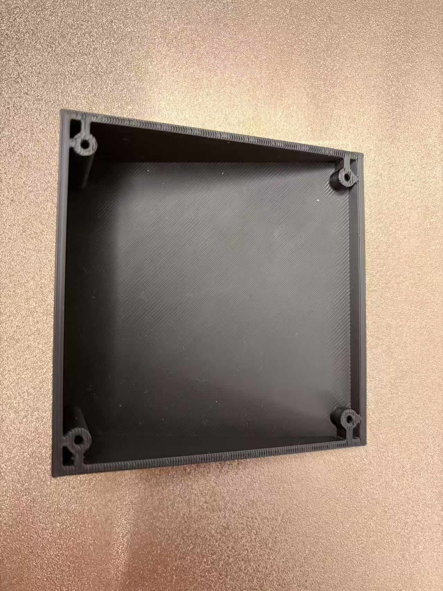
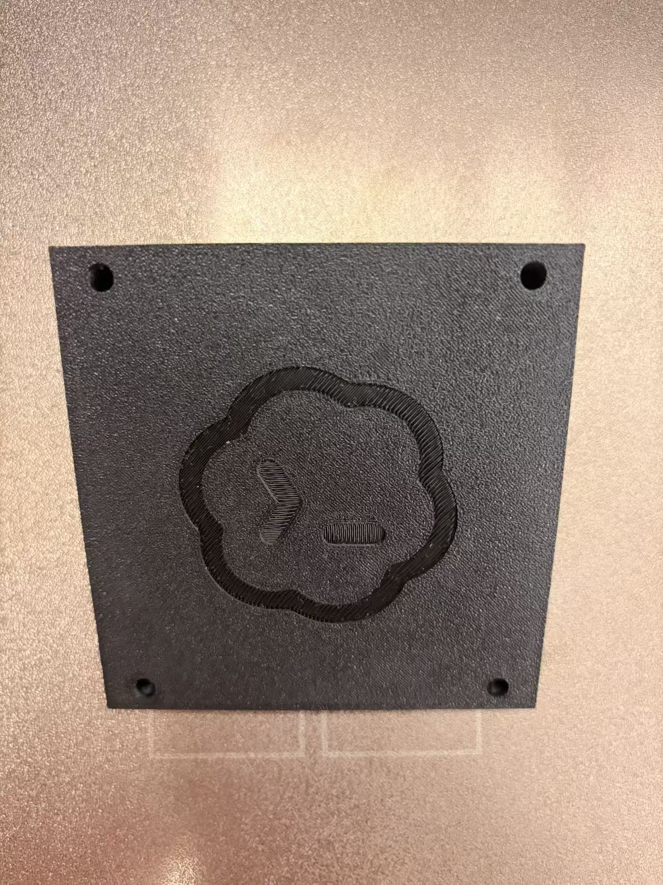
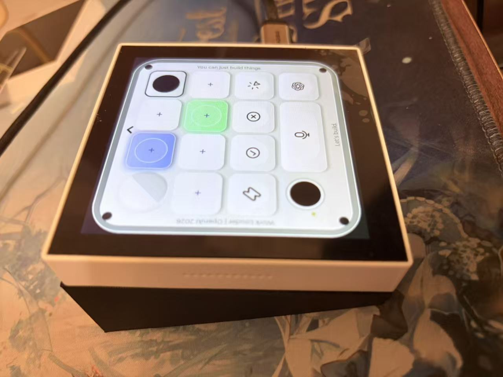

# codex-micro-waveshare

面向 **Waveshare ESP32-S3-Touch-LCD-4B** 的非官方 Codex Micro 兼容系统，由 Jhckevin 维护。



固件在 480 × 480 触摸屏上复现 Codex 控制界面，提供 USB/BLE、六层按键、状态灯效、音效、电源管理和 Windows 管理客户端。项目独立于 OpenAI、Work Louder 与 Waveshare，不表示任何官方认证。

> **第一次使用前，请阅读 [完整中文使用、自行构建、装配和故障排查手册](docs/USER_GUIDE.zh-CN.md)。**
> 手册包含逐个按键说明、双 USB 接口、连接与配对、全部设置、按键映射、更新、充电、续航估算、底座打印和测试边界。

## 项目组成

| 目录 | 内容 | 当前平台状态 |
|---|---|---|
| [firmware/](firmware/) | ESP-IDF 固件、嵌入式 UI、触摸、USB/BLE、灯效、音频、电池和电源管理 | Windows 宿主已适配并验证；基础 USB/BLE 兼容路径面向 macOS，但未实机验证 |
| [desktop/](desktop/) | 独立 Electron + React + Vite + Tailwind 管理客户端 | **目前仅针对 Windows 适配和验证** |
| [hardware/](hardware/) | 倾斜底座、打印文件、Fusion 工程、紧固件与电池仓说明 | 以实际板卡和电池复核尺寸 |
| [docs/](docs/) | 中文详细手册、实机照片、模拟器截图和验证说明 | 模拟图均明确标注，不冒充实机 |

Desktop 是独立子项目，可以单独安装依赖、测试和构建；它不嵌入 ESP32 固件。

## 界面预览

### 嵌入式设备

下方第一张是实物照片，第二张是固件真实帧缓冲。帧缓冲能准确展示 UI 内容，但不能展示真实背光、面板撕裂或动画帧率。

| 实物运行 | 真实帧缓冲 |
|---|---|
|  |  |

### Windows Desktop

以下截图来自客户端内置 QA 模拟设备，用于展示界面与操作流；不代表截图时真实执行了 USB、BLE 或更新。

| 分层、键帽与映射 | 热补丁/完整固件更新 |
|---|---|
|  |  |

客户端支持设备连接、分层路由、Codex 透传、Windows 快捷键、MIC/Typeless 模板、轴体音效、键帽图标、自定义单色 SVG、设备设置、热补丁与完整固件更新流程。公开源码不预置私有更新服务器。

## 3D 打印倾斜底座

底座隐藏电池并提供倾斜视角。内部空间可适配比当前 4000 mAh 电池更大的长方形软包电池，但**宽度不得超过 60 mm**；厚度、长度、保护板、引线方向和膨胀余量仍必须逐项测量。

| 内部与固定柱 | 带 Codex 标记的底面 | 装配后的倾斜效果 |
|---|---|---|
|  |  |  |

模型、打印方向、螺丝组合和装配注意事项见 [hardware/README.md](hardware/README.md)。工程模型以 Fusion 360 原生文件保留，并配套 STL 供自行切片。

## 硬件与电池

只面向 **ESP32-S3-Touch-LCD-4B**，不要用于名称相近的其他微雪屏幕。

- [微雪官方 Wiki：ESP32-S3-Touch-LCD-4B](https://www.waveshare.net/wiki/ESP32-S3-Touch-LCD-4B)
- 4 英寸、480 × 480、ST7701、GT911、ESP32-S3、16 MB Flash、8 MB PSRAM
- USB TO UART 用于刷写、日志和恢复；原生 USB 用于日常 Codex/配置通信
- 板载 PWR、BOOT 和 CHG LED；CHG LED 保持微雪原生硬件逻辑，本项目不重定义

当前电池档案为 **606080、ATL A 类、3.7 V、4000 mAh / 14.8 Wh、带智能 IC 保护板**。固件把 AXP2101 软件充电上限限制为 **1.2 A**；更换电池时必须先按新电池资料重新评估。

## 当前版本的加密状态

**当前公开源码版本已经关闭加密套件。** 默认构建不启用 Secure Boot、Flash Encryption、eFuse 写入、设备唯一绑定、激活校验或私有公网更新鉴权；用户可以自行编译、烧录、修改或完全替换固件。

这里的“关闭”不会撤销芯片此前已经烧写的 eFuse。曾启用安全功能的开发板，必须先核对真实 eFuse 状态。

## 自行构建

仓库只提供源码，不提供 Release、固件镜像、安装包或 portable 文件。

固件使用 ESP-IDF 5.4.2：

```sh
cd firmware
idf.py set-target esp32s3
idf.py build
idf.py -p YOUR_UART_PORT flash monitor
```

Windows Desktop 使用 Node.js 24：

```powershell
cd desktop
npm ci
powershell -ExecutionPolicy Bypass -File native/build.ps1
npm test
npm run build
```

完整环境、烧录、BOOT 恢复、客户端打包和验收步骤见 **[中文详细手册](docs/USER_GUIDE.zh-CN.md)**。

## 平台与状态

- 固件：Windows 宿主已适配和验证。
- 固件连接层：保留 macOS 基础兼容设计，但尚未在 macOS 实机验证。
- Desktop：目前仅支持 Windows。
- 更新：源码包含更新链路，不提供官方公共包或默认服务域名。
- 安全：公开默认配置关闭 eFuse 和固件加密。

## 许可

项目代码使用 MIT License；第三方组件、名称、图标和素材遵循各自许可与权利声明。参见 [LICENSE](LICENSE) 和 [firmware/NOTICE.md](firmware/NOTICE.md)。
