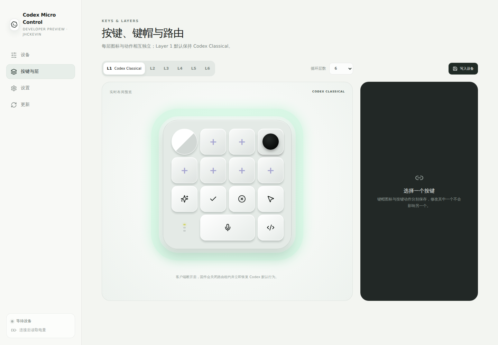
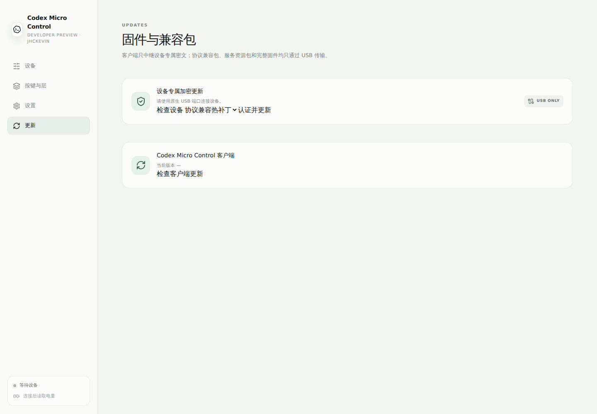

# Codex Micro Control（Windows）

这是 `codex-micro-waveshare` 的独立宿主机管理客户端，技术栈为 Electron、React、Vite、Tailwind 与 wouter。它可以单独安装依赖、测试和构建，不参与 ESP32 固件绘制。

## 平台边界

**当前只针对 Windows 适配并验证。** 固件自身保留基础 macOS 连接兼容设计，但本 Desktop 的原生 HID、BLE helper、快捷键、应用前台切换、安装和更新逻辑均未提供 macOS 实现。

## 主要功能

- 通过 USB 或 BLE 连接设备并读取状态；
- 管理 Layer 1～6 和循环层数；
- 每层独立设置图标与动作；
- Codex 原生透传、客户端动作和禁用路由；
- 复制、粘贴、剪切、Win、Click to Do、窗口置顶、Typeless、Win+H、命令面板等预设；
- MIC 按住/松开 Right Alt 与点按 Right Alt 两种模板；
- 自定义组合键和打开应用；
- 单色 SVG 图标导入与 USB 内容传输；
- 亮度、音量、轴体音效、通信方式、BLE 槽位和省电设置；
- USB 热补丁、完整固件更新、确认与取消流程；
- 客户端自身更新接口。





截图使用内置 QA 模拟设备，不代表真实硬件连接或更新成功。实机验收请按 [完整中文手册](../docs/USER_GUIDE.zh-CN.md) 执行。

## 构建

需要 Node.js 24、Windows SDK 和 MSVC：

```powershell
npm ci
powershell -ExecutionPolicy Bypass -File native/build.ps1
npm test
npm run build
```

需要自行生成安装包时：

```powershell
npm run dist:win
```

仓库不提供 Release、portable 或预编译 helper。Electron 发布默认关闭，更新服务地址也不硬编码。自行托管者可通过 HTTPS 配置 `CODEX_MICRO_UPDATE_BASE_URL`，但必须自行维护清单、签名、固件兼容性和回滚测试。

## 连接与回退

高级按键路由只有在客户端会话有效时生效；客户端退出或断链后，固件回退到经典 Codex 布局。上传新图标和固件包必须使用原生 USB；BLE 只用于轻量设置和日常管理。
