# codex-micro-waveshare 使用手册

这份手册对应仓库中的 **ESP32-S3-Touch-LCD-4B 固件、Windows Desktop 和 v0.9 倾斜底座**。先完成 USB 基础连接，再使用 BLE、分层映射和自定义图标；第一次使用不需要安装电池，也不需要同时配置所有功能。


图中的屏幕、触摸键和灯环由固件绘制；外壳与板卡来自微雪，底座是本项目提供的扩展打印件。它是非官方兼容项目，Codex App 更新可能改变识别和映射方式。

**图片怎么看：**“LVGL 离屏截图”运行的是当前固件的 UI 源码及生成素材，展示布局和控件，不模拟背光、电池传感器或无线连接；“Desktop QA 截图”运行的是实际 React 页面和模拟设备数据；“示意图”用于解释位置或操作关系，不是尺寸图。每个截图都放在对应操作章节，数值仅为演示。

## 阅读路线

- **第一次装机：**[准备](#prepare) → [接口与侧键](#hardware-controls) → [USB 使用](#usb) → [Codex 配置](#codex-settings)。
- **已经能控制 Codex：**[三页设置中心](#settings-one) → [屏保与省电](#power) → [Arcade](#arcade)。
- **想自定义：**[Desktop 连接](#desktop-connect) → [层与路由](#routing) → [MIC / Typeless](#mic-template) → [图标](#icons)。
- **自己构建或装底座：**[环境版本](#versions) → [固件构建](#firmware-build) → [Desktop 构建](#desktop-build) → [零件清单](#parts) → [装配](#assembly)。

完整目录：

1. [准备硬件与选择使用方式](#prepare)
2. [接口、侧键与板载指示灯](#hardware-controls)
3. [USB 首次连接与无电池使用](#usb)
4. [BLE 配对、三个槽位与重连](#ble)
5. [在 Codex App 中配置设备](#codex-settings)
6. [经典界面、点按、长按和旋转](#classical)
7. [灯效、颜色与层指示灯](#lights)
8. [设置中心第一页：连接、电池、音量](#settings-one)
9. [设置中心第二页：显示、计时、特殊模式](#settings-two)
10. [设置中心第三页：PWR 与 Ultra](#settings-three)
11. [屏保、保护待机、Ultra 与关机](#power)
12. [Arcade 彩蛋与三种操作界面](#arcade)
13. [Desktop：连接、刷新与状态](#desktop-connect)
14. [Desktop：层、Codex 透传与动作路由](#routing)
15. [实例：把 MIC 设为 Typeless](#mic-template)
16. [Desktop：快捷键、自定义组合和应用](#shortcuts)
17. [Desktop：键帽、单色 SVG 和内容包](#icons)
18. [Desktop：全部设备设置与声音](#desktop-settings)
19. [Desktop：托盘、启动与退出](#tray)
20. [热补丁、完整固件和客户端更新](#updates)
21. [电池、电量、充电与续航](#battery)
22. [软件版本与工具环境](#versions)
23. [从源码构建、刷写与恢复固件](#firmware-build)
24. [从源码运行和打包 Windows Desktop](#desktop-build)
25. [底座零件清单与选型](#parts)
26. [打印、试装、布线与装配](#assembly)
27. [故障排查与验证边界](#troubleshooting)
28. [扩展玩法、截图复现与许可](#extend)

<a id="prepare"></a>
## 1. 准备硬件与选择使用方式

本固件只面向 **Waveshare ESP32-S3-Touch-LCD-4B**。名称相近的 4 英寸微雪板、Core2 或其他 ESP32-S3 屏幕不能直接套用：屏幕时序、触摸引脚、电源管理和分区可能不同。以包装和 PCB 丝印核对完整型号，再参照[微雪官方 Wiki](https://www.waveshare.net/wiki/ESP32-S3-Touch-LCD-4B)中的资源位置图、原理图与示例。

第一次使用准备板卡、一根支持数据的 Type-C 线和 Windows 电脑即可。要自行刷写或抓日志，再准备第二根数据线接 USB TO UART。只有供电的线会让屏幕亮起，却不能让电脑发现设备；这时软件设置无法补出数据通道。

使用方式有三种：

| 方式 | 适合什么情况 | 你需要知道 |
|---|---|---|
| 无电池 + USB | 固定桌面、先验证软件、暂不装底座 | 支持随插随用；拔线即断电 |
| 有电池 + USB | 长时间桌面使用、希望拔线后继续用 | 系统供电和电池充电由 PMIC 管理；插线不代表始终正在充电 |
| 有电池 + BLE | 无线放置、切换已绑定电脑 | 需要先配对；依靠电池续航和省电设置 |

推荐先选第一种，确认按键与电脑响应后再装电池。首次编译和烧录见第 23 章；仓库不提供预编译固件、安装器或 Release。Windows 是本项目主要适配和验证环境；固件保留 macOS 基础 USB/BLE 兼容设计，但没有完成 macOS 实机验证，Desktop 当前仅适配 Windows。

<a id="hardware-controls"></a>
## 2. 接口、侧键与板载指示灯

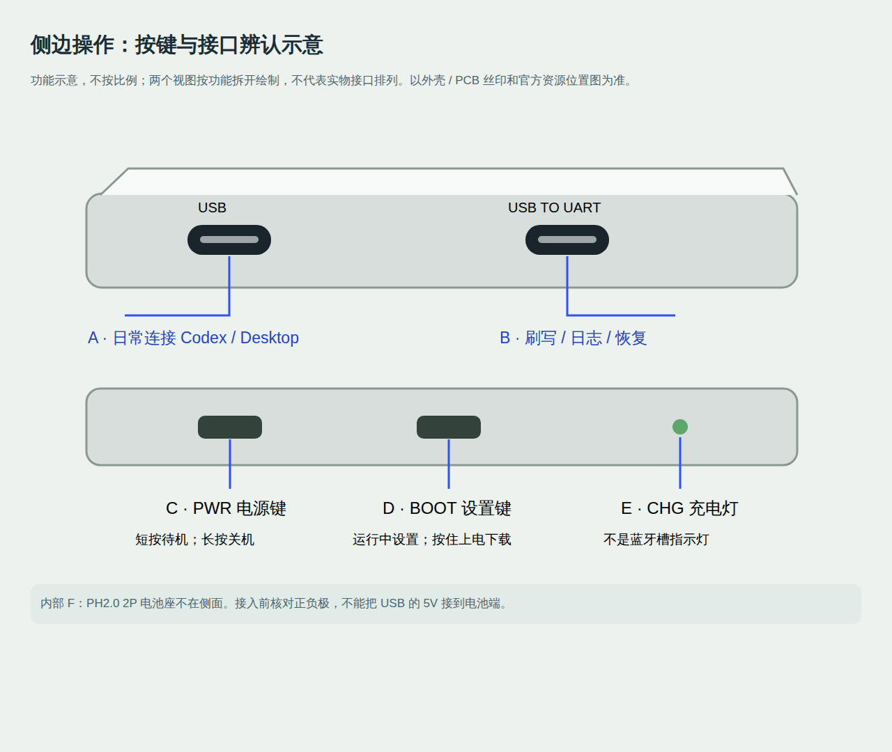

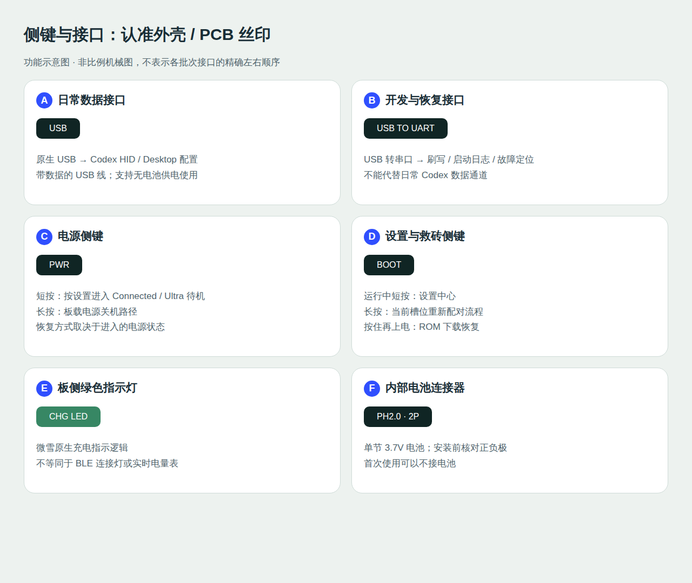

**图解：**A 是日常原生 USB，B 是刷写与调试串口，C/D 是侧边按键，E 是微雪原生充电灯，F 是内部电池连接器。示意图按功能分组；设备旋转摆放、外壳版本和观察方向会改变“左”“右”，请优先认丝印。

| 标识 | 在本项目中的用法 | 操作后应观察什么 |
|---|---|---|
| USB | 原生 USB 数据、Codex 控制、Desktop 配置和内容传输 | Codex / Desktop 是否完成各自握手 |
| USB TO UART | USB 转串口刷写、启动日志、故障恢复 | Windows 新增的串口及日志输出 |
| PWR | 短按按配置进入 Connected standby 或 Ultra；待机时恢复；长按走 PMIC 关机 | 当前电源状态，而不只是界面亮暗 |
| BOOT | 正常运行短按打开/关闭设置；长按进入当前槽位重新配对流程 | 设置中心或配对提示 |
| BOOT + 上电 | 按住 BOOT 接回电源，进入 ROM 下载 | 电脑枚举的下载设备 |
| CHG LED | 板载充电状态指示 | 配合电池状态读数判断，不能单凭灯猜电量 |
| PH2.0 2P | 单节 3.7V 电池连接器 | 正负极、线材和电池存在状态 |

PWR 和 BOOT 是两个不同的按键。想打开设置请短按 BOOT；想暂时不用设备请短按 PWR。BOOT 的上电下载功能由 ESP32 启动路径决定，应始终保留 GPIO0 和原有连接。不要因常规按键映射而断开 BOOT 引脚。

CHG LED 没有被本项目改成蓝牙灯。设备设置页中的小虚拟 BLE 灯另有含义，屏幕左下三颗层灯又是第三种指示。绿色灯熄灭不等于没电或硬件坏了；读取是否有电池、VBUS 是否存在、PMIC 是否处于充电状态，再判断问题。精确亮灭行为以微雪板卡资料和实际批次为准。

<a id="usb"></a>
## 3. USB 首次连接与无电池使用

1. 先连接板卡标为 **USB** 的原生端口，接电脑的正常数据端口。
2. 等待设备启动进入经典界面。不要用“亮屏了”代替数据连接确认。
3. 打开 Codex App，查看是否出现 Codex Micro 设备入口。
4. 短按设备 BOOT，在设置第一页检查模式和连接状态。日常可先用 AUTO；专门排查 USB 时用 USB。
5. 在 Codex 中选择一个可辨识的任务，点设备的 Agent 键，检查任务是否切换。再检查一次 MIC 按下和松开。
6. 若需要高级配置，再打开 Desktop 连接设备。Codex 能用与 Desktop 已连接是两项独立结果。

**无电池完全支持。** 电源管理芯片负责 USB 输入到系统的电源路径，电池充电参数针对充电支路。用户正常使用只需接合适的 USB 数据/电源，不需要自己桥接电池座、向电池端灌入 USB 电压或人为设置“直通充电电流”。不过，本手册并不把无电池识别成功等同于完成电源瞬态测量。

没有电池时，设备应显示 No battery；宿主为了兼容可能显示 100%，这是占位值。无电池缺少电池缓冲，拔线即断电；接触不良、输入不足也更容易打断运行。写设置、传图标或更新期间保持连接稳定。有电池通常有更好的移动和断电体验。

两个 USB 口可以分别用于日常连接和诊断。Windows 的 COM3、COM5 等编号由系统分配，换线或重启后可能变化；不要把 COM 编号写成设备永久身份。原生 USB 正常运行也可能以 HID 而不是串口出现。

<a id="ble"></a>
## 4. BLE 配对、三个槽位与重连

BLE 1 / 2 / 3 是保存绑定关系的三个槽位，不是三个能同时控制的主机连接。把它当作“这台电脑占一个槽位”最容易操作，例如 BLE 1 留给桌面机，BLE 2 留给另一台电脑。日常切换用短按；重新绑定才使用长按或清除操作。

首次配对建议这样做：

1. BOOT 打开设置，确认 Bluetooth on，选择 BLE 模式及准备使用的槽位。
2. 对该槽执行重新配对流程。设置区虚拟灯会提示配对窗口；当前设计约 20 秒后结束提示窗口。
3. 在 Windows“设置 → 蓝牙和设备 → 添加设备 → 蓝牙”中选择设备。
4. 系统显示连接后，回设备设置和 Codex 再检查协议是否可用。系统配对成功只完成链路的一部分。
5. 记住槽位对应的电脑。换到另一台电脑时使用另一槽，避免反复覆盖原绑定。

重新靠近已配对主机时，设备和系统会尝试恢复连接，但主机蓝牙状态、当前槽位、系统缓存和睡眠状态都可能影响结果。若不重连，先核对槽位，再检查 Bluetooth 开关与模式；不要首先清除所有绑定。确需重新配对时，同时删除 Windows 中的旧条目和设备对应槽位记录，避免只清一端造成密钥不一致。

虚拟 BLE 灯在配对时闪烁，连接成功后短时常亮再熄灭；灯灭本身不代表通信断开。三主机热切换涉及实际设备组合，本项目没有对所有主机和系统组合完成验收。桌面客户端的 BLE 管理可调整已有设置，但 SVG/图标内容和固件包传输需要 USB。

<a id="codex-settings"></a>
## 5. 在 Codex App 中配置设备

先区分 **Codex App** 与 **Codex Micro Control（Desktop）**。前者决定任务选择、原生命令和任务灯；后者负责本项目的设备设置及高级按键映射。只想用经典 Codex 控制，通常不需要让 Desktop 常驻。

Codex 不同版本的入口文字和位置会变化。连接设备后，从窗口中的 Codex Micro 设备图标/设备状态入口打开设备设置；若当前版本把入口放在设置中，查找 Codex Micro 或设备区。下面的选项说明依据项目历史设备界面与兼容实现，**不能保证所有版本都有同名菜单**。[OpenAI 当前设置文档](https://developers.openai.com/codex/app/settings)是通用设置参考，没有承诺第三方设备的全部菜单。

### 5.1 六个智能体键

在 Codex 的设备布局或“智能体键”设置中，为六个物理 Agent 键选择对应任务。先只绑定一个容易识别的任务，回到设备点按该键，确认电脑切到目标任务，再继续绑定其余键。没有分配任务的键应保持空闲/熄灭外观；不能因为键帽上有“+”就认为已经绑定。

当任务运行、完成、等待回复或出错时，Codex 发回对应状态，设备更新 Agent 灯。设备自己的层号和 Desktop 图标不创建 Codex 任务，也不替代这里的绑定。如果换任务后灯没有及时变化，先判断 Codex 连接状态，再判断灯效，不要靠手动给键涂色掩盖协议问题。

### 5.2 原生命令和旋钮

Codex 的键盘布局设置可决定原生命令的含义。经典命令区默认展示闪电、确认、取消、Computer Use、MIC 和 Codex 图标，但实际动作由宿主版本和用户设置决定。修改一个映射后，用无破坏性的场景验证它，例如先验证导航或打开设置，避免拿正在请求批准的任务试错。

历史界面中的旋钮模式可用于浏览编辑器控件：向右/向左移动焦点，点按打开或选择，静止长按打开设备设置。这是宿主配置的示例，固件负责旋转、点按、长按事件；如果 App 选择别的模式，最终行为也会改变。

### 5.3 自动调暗与设备屏保

| 你改的地方 | 影响 | 不应期待的效果 |
|---|---|---|
| Codex 的自动调暗 | Codex 在闲置后下发灯光关闭/调暗状态 | 不直接等同于 LCD 断电 |
| 设备 Screen 时间 | 决定设备何时进入屏保 | 不会改变任务绑定 |
| 设备 Smart screen | 要求无操作且相关灯光持续全灭后才满足屏保条件 | 不强制把忙碌任务变为空闲 |
| Desktop 动画强度 | 调整本地呈现强度 | 不改 Codex 状态语义 |

例如 Codex 自动调暗为 3 分钟，设备 Screen 为 3 分钟，且 Smart screen 开启：灯在前 3 分钟仍亮时，设备不会仅因没触摸就立刻黑屏；等灯熄灭后，还要满足设备自身的连续暗灯和无操作时间。因此两个时间不一定“同步到点”。

### 5.4 功能受限或通信中断

出现红字、功能受限、自动重连时，先停止连续点击，查看 Windows 是否仍识别设备及设备设置是否 Ready。系统“已连接”不能证明 Codex 的 RPC/HID 会话健康。USB 先确认插的是原生口；BLE 先确认当前槽位与绑定。更新 App 后入口或协议改变属于兼容边界，记录 App 版本、固件版本和复现步骤，见第 27 章。

<a id="classical"></a>
## 6. 经典界面、点按、长按和旋转

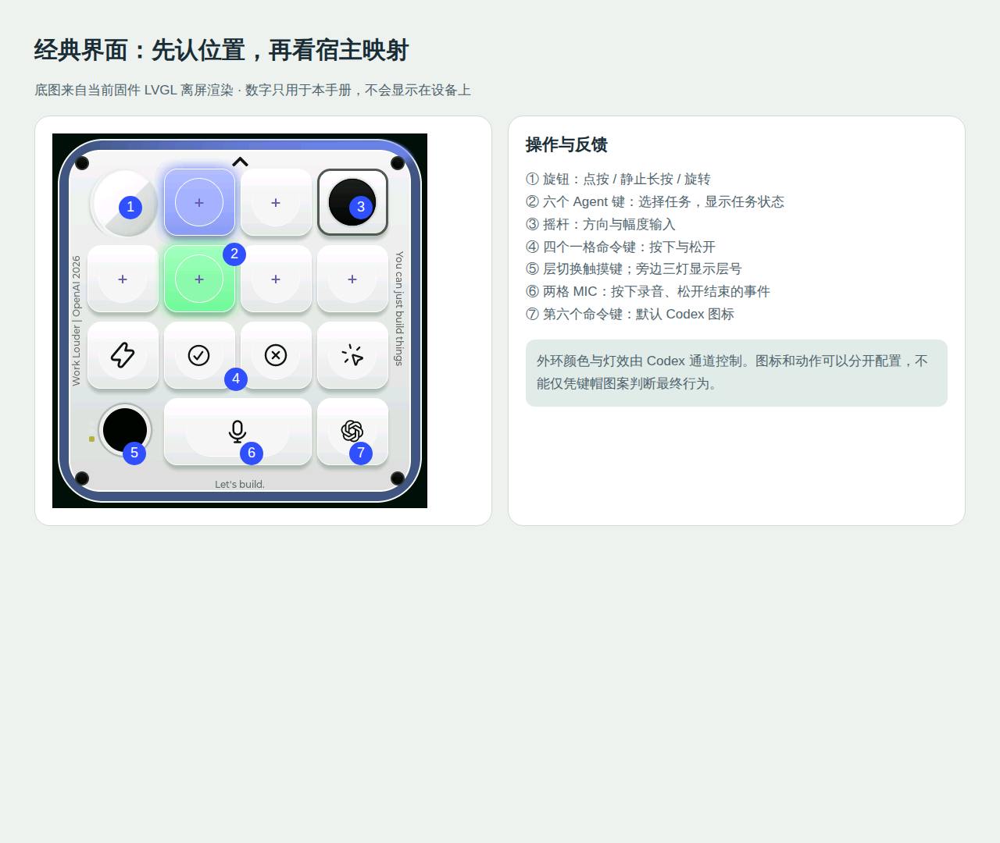

图中数字是手册标注，设备本身不显示这些编号。屏幕上的键看起来像键帽，但它们使用电容触摸，手感依赖触摸识别、按下动画和音效。点按应有明确的按下与离开；想持续按住时，保持手指在该键有效区域，完成后松开。

- **Agent 区（②）：**六个任务键。颜色与明暗是宿主状态反馈，可不同颜色、同速同步呼吸。点按用于对应任务操作。
- **普通命令区（④、⑥、⑦）：**共六个命令，其中 MIC 占两格。图标与最终动作可分开配置。
- **旋钮（①）：**围绕旋钮中心做转动手势。静止按住才可解释为长按，旋转期间不应再触发长按。
- **摇杆（③）：**从中心往外拖，位移决定幅度、方向决定输出；松手回中。中心死区避免误触。
- **层键（⑤）：**左下圆形触摸键，短按换层；使用独立擦声音效。相邻三颗灯表示层号。

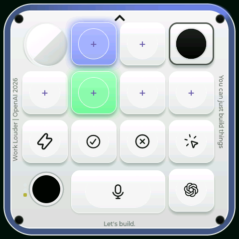

**LVGL 离屏截图：**演示 MIC 的按下状态。真正录音使用电脑端麦克风及权限，屏幕上的 MIC 事件不代表板载麦克风音频已经被传给 Codex。测试时应同时看电脑录音指示：按下是否开始、持续按住是否保持、松开是否停止。图标弹起只证明 UI 状态发生变化，不能代替宿主确认。

使用旋钮时尽量先保持手指稳定，再明确开始转动；用摇杆时从中心拖向一个方向，观察电脑后再增大幅度。经典灵敏度从 100% 起调最容易比较，Arcade 使用独立参数。

<a id="lights"></a>
## 7. 灯效、颜色与层指示灯

外围灯轨是屏幕模拟的导光效果。Codex 的 ambient 配置决定它的颜色、亮度、速度和效果；任务工作时常见沿轨道移动的 snake，临时提示可能整圈常亮。六个 Agent 键由任务状态控制，普通命令键又有自己的灯光配置。切层不会把外围灯环所有权交给 Desktop。

| 协议灯效 | 视觉含义 | 如何理解 |
|---|---|---|
| off | 关闭该区效果 | 熄灭不等于硬件断电 |
| solid | 稳定亮色 | 没有运动是预期状态 |
| snake | 亮区沿灯轨移动 | 速度由宿主配置影响 |
| rainbow | 彩虹变化 | 颜色随周期变化 |
| breath | 明暗呼吸 | 同速 Agent 使用全局相位 |
| gradient | 渐变效果 | 由本项目兼容渲染呈现 |
| shallowBreath | 较浅呼吸 | 明暗幅度小于强呼吸 |

这些名称表示兼容的协议类型，不代表 LCD 与原机实体 LED 的光学效果完全一致。预计算素材用于减少运行时绘制开销；截图不能证明动画帧率，也不能证明没有物理撕裂。

三颗层灯按设备正常使用方向由上到下读取，当前代码是：

| 当前层 | 上 | 中 | 下 |
|---|---|---|---|
| 1 | 灭 | 灭 | 亮 |
| 2 | 灭 | 亮 | 灭 |
| 3 | 亮 | 灭 | 灭 |
| 4 | 灭 | 亮 | 亮 |
| 5 | 亮 | 亮 | 灭 |
| 6 | 亮 | 亮 | 亮 |

这是六状态查表，不是把数字当成二进制直接显示。Desktop 限制循环为两层时，只在 1、2 间切换；图标不同不代表层号变化，以层指示和 Desktop 当前层共同确认。

<a id="settings-one"></a>
## 8. 设置中心第一页：连接、电池、音量

短按 BOOT 打开 Settings Center。底部 **Next > / < Previous** 用于翻页，圆点指示页数；此版本不使用横向拖动分页。右上 x 关闭菜单。设置应在设备确认并保存后生效，正在写入时不要拔电。


**LVGL 离屏截图：**73%、4.000V、40% 音量为样例输入，不能视作当前设备实测。

| 控件 | 如何操作 | 生效范围与结果 |
|---|---|---|
| AUTO | 点一下 | 自动协调可用连接，适合日常先用 |
| USB | 点一下 | 日常通信走原生 USB；UART 开发口仍是独立路径 |
| BLE | 点一下 | 使用当前 BLE 槽位；需要打开蓝牙 |
| MIX | 点一下 | 允许 USB/BLE 并用，通常更耗电 |
| BLE 1 / 2 / 3 | 短按切换，长按配对流程 | 会改变当前目标主机，不是换 UI 皮肤 |
| connected 与圆点 | 只读 | 代表固件会话状态；与系统设备条目区分 |
| 电池卡片 | 只读 | 百分比、充电状态、电压、配置功率上限 |
| Key volume | 拖动滑块 | 10%–100% 分档；不是更换声音预设 |
| Bluetooth on/off | 点按 | 打开或关闭蓝牙，关闭会影响无线管理 |
| Reset Bluetooth | 点按前先确认当前槽 | 触发重置配对流程；必要时电脑端也忘记设备 |

电池卡片里的 **limit** 是充电配置上限，不是实时功率测量。比如 1.2A 档在界面按内部参考电压换算可能显示约 4.92W，与手册用 4.2V 计算的理论 5.04W 不矛盾；两者都不是电池实时电流传感器。

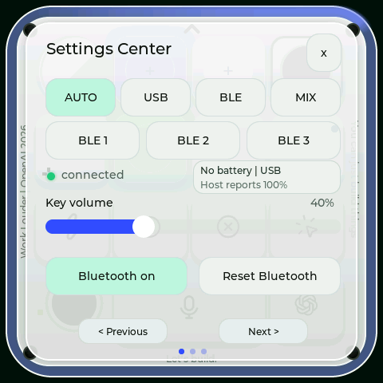

无电池时应出现 No battery，不能据此要求软件显示“正在充电”。调整音量后点一个普通命令键试听，再点左下层键比较；两者素材不同，但不应因为切到另一个层就随机换轴体声音。想选 Linear/Tactile/Clicky，请到 Desktop 的声音设置。

<a id="settings-two"></a>
## 9. 设置中心第二页：显示、计时、特殊模式

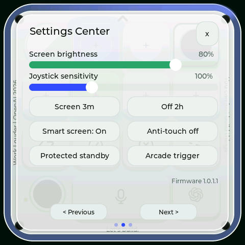

这一页把“看起来多亮”“多久进入省电”“防止误触”放在一起，但这些控件的作用不同。先设置 Screen 时间，再决定是否打开 Smart screen；调整自动关机时不要把它当成屏保时间。

| 屏幕文字 | 操作 | 意义与例子 |
|---|---|---|
| Screen brightness | 拖动 10%–100% | 正常显示亮度；10% 仍是亮屏，不是关背光 |
| Joystick sensitivity | 拖动 | 经典摇杆 50%–200%；150% 比 100% 更敏感 |
| Screen | 逐次点击 | 关闭、30秒、1/3/10/30分钟、1小时 |
| Off | 逐次点击 | 自动关机：关闭、1/2/3/5小时；默认 2小时 |
| Smart screen: On/Off | 点按切换 | 开启后，要求无操作且任务/普通键/外环灯持续关闭 |
| Anti-touch off | 点按切换 | 防误触自动关机；开启后零星触摸不延后断连关机计时 |
| Protected standby | 点按进入 | 进入必须滑动解锁的保护界面 |
| Arcade trigger | 点按一次 | 生成彩蛋输入轨迹并进入 Arcade 控制页 |
| Firmware | 只读 | 当前固件设置版本标签 |

“Off 2h”中的 Off 是关机项目的标签，**不是说关机功能已关闭**；后面的 2h 才是当前时间。“Anti-touch off”则表示该防误触开关当前关闭。这种文字相似性容易混淆，因此先看完整标签。

如果希望任务忙碌时一直看到灯，开启 Smart screen；如果只想固定时间无操作就暗屏，关闭它。Screen 设置为关闭后，智能条件本身不会额外启动自动屏保。PWR 手动操作仍按第三页配置执行，不受“自动屏保关闭”限制。

<a id="settings-three"></a>
## 10. 设置中心第三页：PWR 与 Ultra

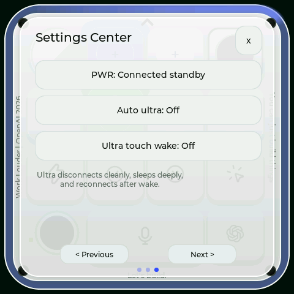

第三页调整更深一级的节电行为。PWR 短按默认是 Connected standby，适合频繁放下再拿起；Ultra 需要卸载显示资源、恢复时重建 UI，因此唤醒代价不同。

| 控件 | 可选值 | 用户应如何选择 |
|---|---|---|
| PWR | Connected standby / Ultra standby | 频繁使用先选 Connected；长时间不用可选 Ultra |
| Auto ultra | 关闭、1/3/5/8/12小时 | 满足空闲和运行条件才进入，不是无条件倒计时 |
| Ultra touch wake | On / Off | 开启允许触控检查唤醒，可能增加待机耗电；关闭后用 PWR |

**当前源码与旧 UI 提示存在差异：**页面下方仍写着 Ultra 会断开并重连。实际电源实现会尝试保留已认证 BLE 会话；有 BLE 链路时采用控制器节电和空闲 CPU，不进入 CPU light sleep。无 BLE 链路时才周期性尝试 light sleep。已挂载的原生 USB 在手动 Ultra 中会停止，恢复时重建。这些区别关系到续航和重连体验，应以本章及实际日志为准。

自动 Ultra 还会避开录音/处理、按住键、摇杆操作、Agent breath、外环 snake 或未完成的 HID 发送；工作结束后有约 5 分钟保护期。插着正常挂载的原生 USB 时，自动 Ultra 不会仅因时间到了就触发。因这些条件，Auto ultra 不是“到点必睡”，也不能拿它承诺十天续航。

<a id="power"></a>
## 11. 屏保、保护待机、Ultra 与关机

| 模式 | 进入方式 | 如何返回 | 连接与显示 |
|---|---|---|---|
| 普通屏保 / Connected standby | Screen 计时或 PWR 映射 | 触摸或 PWR | 目标是保留会话，停止常规绘制并降低显示输出 |
| Protected standby | 第二页按钮 | 唤出解锁页后把条拖到终点 | 不直接暴露经典触控键 |
| Ultra | 第三页定时或 PWR 映射 | PWR，或启用的触控唤醒 | 卸载显示资源；BLE/USB处理见上章 |
| 自动关机 | 断连且关机条件到期 | 电源路径重新开机 | 结束工作状态，需重新连接 |
| PMIC 长按关机 | PWR 长按 | PWR 开机路径 | 由板载电源管理处理 |

### 11.1 智能屏保的具体例子

Screen = 3分钟，Smart screen = On。你离开 5分钟，但 Agent 灯一直在显示任务，设备不应只因为没触摸而进入自动屏保。任务灯、普通键灯、外环都关闭后，保持暗灯且无操作达到设定时间才满足条件。其间任何相关灯亮起会重新开始暗灯计时，触控会刷新操作计时。

这个规则关注收到的灯光状态，不理解任务内容本身。若宿主已关灯但任务仍在后台工作，设备不能凭空知道任务是否“实在有意义”；需要 Codex 的状态输入。自动调暗与智能屏保的关系见第 5 章。

### 11.2 保护待机的解锁步骤

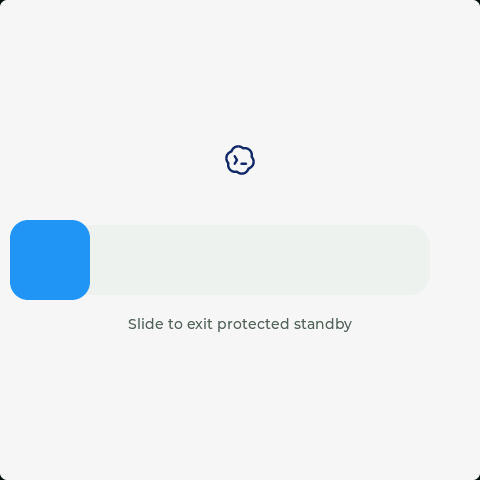

按第二页 Protected standby 后进入黑屏保护。按任意侧键，或在约 1.5 秒内连续触摸两次，可临时显示上图；把宽滑块拖到另一端并松开才退出保护。没有完成拖动时，约 3 秒无操作会返回黑屏。解锁页只出现 Logo 和滑条，目的就是避免唤醒时误触 MIC 或命令键。

### 11.3 多个计时器同时到期

判定优先级为 **自动关机 > Ultra > 普通屏保**，但每种模式先检查自己的条件。自动关机要求没有有效连接；关闭防误触关机时依据无操作时间，开启时依据连续断连时间。已经满足优先级更高的条件时，不会先执行一次低级状态再立即执行高级状态。

因此把 Screen 设得比 Ultra 长或短，都不意味着两个动作同时强行执行。退出 Ultra 后会刷新用户活动与断连计时；恢复和重连期间留有处理过程。Arcade 期间当前自动计时判定被抑制，玩完请退出游戏控制页或手动用 PWR。

### 11.4 暗室残光边界

本版本仍有 Standby 微弱蓝光的用户反馈，不能保证屏幕黑色与物理断电一样。软件已经有背光控制和待机路径，但“当前控制未完全消除残光”**不能直接证明主板没有任何控制引脚**。原理图、背光电源测量和暗室验收尚不能被截图替代。

需要完全无光时，应实际核验关机或断电；也不要把 Ultra 仅凭名称当作必然零发光。保留这一限制是为了说明真实体验，而不是把残光问题标为已修复。

<a id="arcade"></a>
## 12. Arcade 彩蛋与三种操作界面

Arcade 是给 Codex 彩蛋使用的设备控制页，不是在 ESP32 上独立运行 Asteroids。电脑端是否识别彩蛋，取决于 Codex 版本、当前焦点与状态。设备进入 Arcade 界面，不等于电脑已经成功进入游戏。

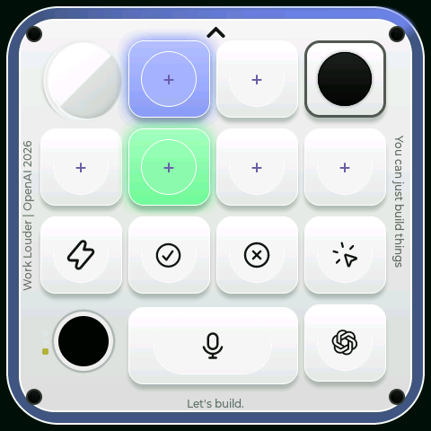

当前进入/退出准备函数只更新会话状态，并没有单独绘制带斜体标题的加载页。因此这两张准备状态截图仍保留前一界面；不要把历史设计中的加载动画当成本版已实现功能。

### 12.1 进入、发射和退出

1. 先确认经典 Agent 键和摇杆能正常影响 Codex。
2. 打开设备设置第二页，点一次 Arcade trigger。
3. 设备生成推出中心后同方向画圈的输入序列；历史兼容条件约为幅度超过 20%、6秒内接近 1.9圈，长停顿或明显反向会打断累计。这是兼容行为记录，不是官方稳定 API。
4. 等待过渡完成，同时看电脑是否进入彩蛋。
5. 在 Arcade 页按左侧 AG00 作为发射输入，用右侧方向区域移动。
6. 结束时点右上 x，等待退出过渡并回到经典界面。设备退出不会保证替电脑关闭游戏。

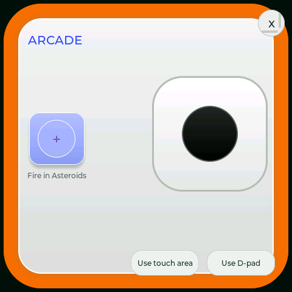

**大摇杆：**从中心拖向一个方向，松开回中；它比经典页大，方便持续方向输入。AG00 仍沿用原 Agent 输入和素材，左侧小字 Fire in Asteroids 是用途提示。外环仍由 Codex 灯效通道决定；截图中的橙色是模拟收到橙色状态，不表示进入 Arcade 后强制覆盖所有宿主颜色。

### 12.2 十字键与触控区域

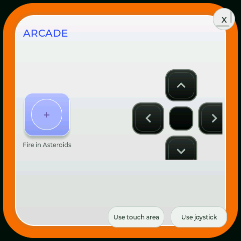

**十字键：**点击 Use d-pad 切换，按分离方向键输出方向。当前离屏截图可看到右侧和下侧方向键有裁切，这是本次默认主机 LVGL 配置下观察到的布局问题；尚未据此完成实机对照，手册保留模拟结果，不把它修饰掉，也不直接认定所有板卡同样表现。遇到触区或方向反馈异常，可切回摇杆再使用。

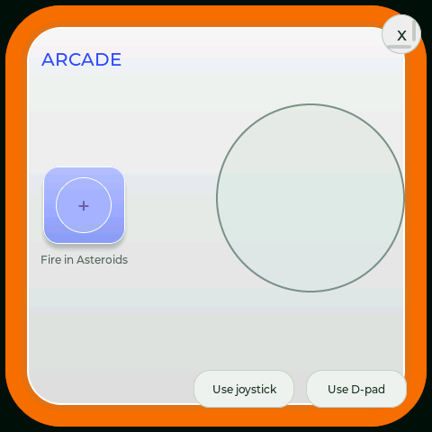

**Touch area：**使用右侧触控区域做类似移动游戏的方向拖动。屏幕下方两个按钮随当前模式变化：一个切换触控区域/十字键，另一个切回摇杆或相邻方式，以实际文字为准。Classic 的 Joystick sensitivity 不应用到 Arcade，以免在桌面模式调灵敏度后游戏突然过敏。


退出后先检查方向已经归零、AG00 不再保持按下，再使用经典 MIC。若电脑没有进入游戏，不要连续点击触发器；先退出 Arcade，验证 Codex 连接和普通输入，再重试一次。

<a id="desktop-connect"></a>
## 13. Desktop：连接、刷新与状态

Codex Micro Control 是独立 Windows 应用。Electron 的本机桥接负责 USB/BLE 与按键注入，React 页面只是可视化界面；浏览器预览不具有完整原生能力。

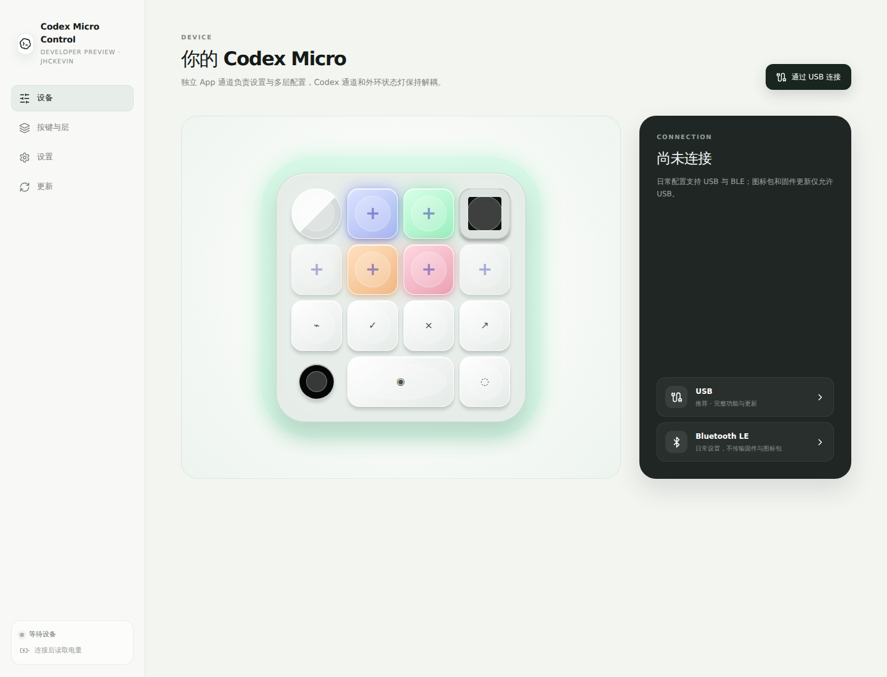

点击“通过 USB 连接”前，先插原生 USB 口。页面也提供 Bluetooth LE，适用于日常设置。连接完成后应看到电池、传输、当前层等读数；无电池显示有相应含义。只在 Windows 设置中看到蓝牙条目，并不能让 Desktop 自动取得自己的控制会话。

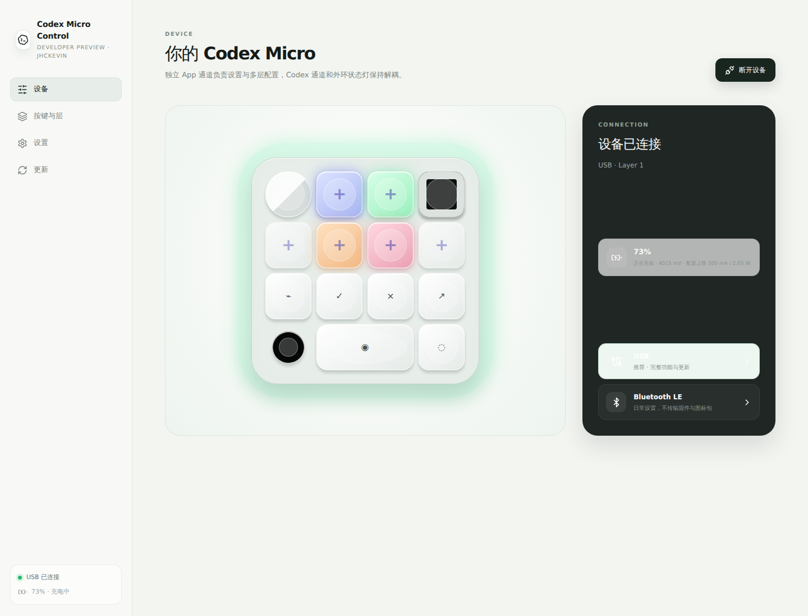

上图 73% 来自 QA 模拟数据。真实使用中，连接页的刷新用于重新读取设备状态；Disconnect 结束的是自家 Desktop 会话，高级路由随后失效。Codex 仍有独立通道，断开 Desktop 后经典控制应回退。

判断一次连接是否成功，至少检查：页面结束等待、设备状态能读回、改一个可逆设置后设备能显示新值。网页模拟器只能验证前两项的模拟流程，不证明 USB 实机通路或 Windows 快捷键执行成功。

<a id="routing"></a>
## 14. Desktop：层、Codex 透传与动作路由

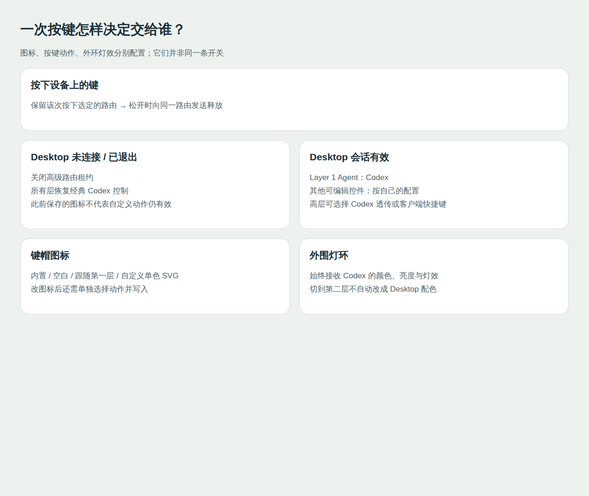

当前共有最多六层。Layer 1 默认是 Codex Classical；高层可以保留 Codex 原生，也可以映射到 Desktop 动作。**Layer 1 的六个 Agent 键在编辑器中锁定为 Codex**；同层六个命令键，包括两格 MIC，可以设置独立动作。高层的旋钮、摇杆等可编辑控件，以页面选择项为准。

图标与逻辑分别保存。复制图标不会自动生成 Ctrl+C，选了 Typeless 也不必强制使用麦克风图标。高层默认可跟随第一层同位置的图标，之后再单独覆盖。

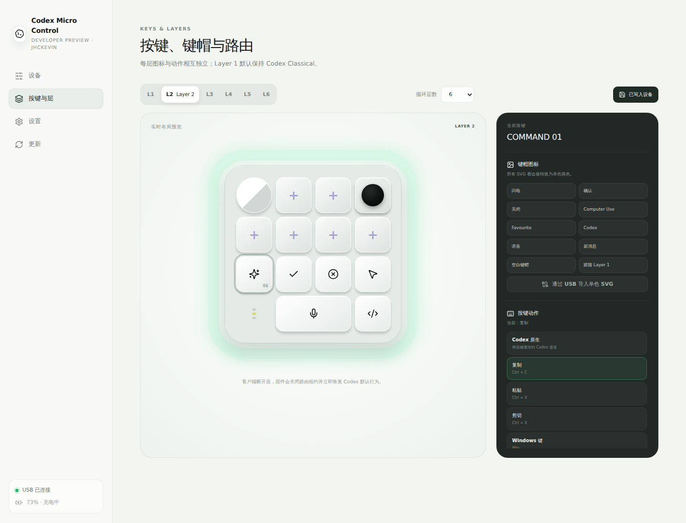

操作步骤：

1. 进入“按键与层”，点顶部 L2。
2. 在设备预览点要修改的键，例如第一颗普通命令键。
3. 右侧“按键动作”选择“复制”；另行选择键帽或保留继承图标。
4. 点击顶部“写入设备”，等待确认。
5. 回实机切到 Layer 2，在文本编辑器选择一小段文字，按该键，再粘贴验证。
6. 退出 Desktop 后重新试：此时应回到经典 Codex 路由，不能继续期待 Ctrl+C。

顶部“循环层数”可选 2～6，选择 2 后实机只在两层间循环，减少切层负担；它不是删除剩余层所有资料的按钮。把高层某键改成 Codex 原生，可保留该键的 Codex 控制，同时其他键继续执行快捷键。

按下与松开应走同一条已锁定路由，切层不能把已经按下的 MIC 的松开错误发送到另一层。若 Desktop 崩溃或失联，固件会话租约结束后关闭高级路由；不要用图标是否还在判断租约，持久化图标和实时动作会话是不同状态。

<a id="mic-template"></a>
## 15. 实例：把 MIC 设为 Typeless

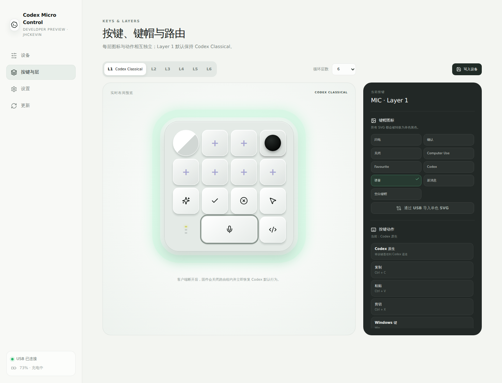

两格 MIC 在每层都是普通命令组中的一个控件。第一层 MIC 可改映射，但第一层 Agent 仍保持锁定。先连接 Desktop，再选择 L1、点设备预览中的 MIC，确认右侧标题显示 MIC · Layer 1。

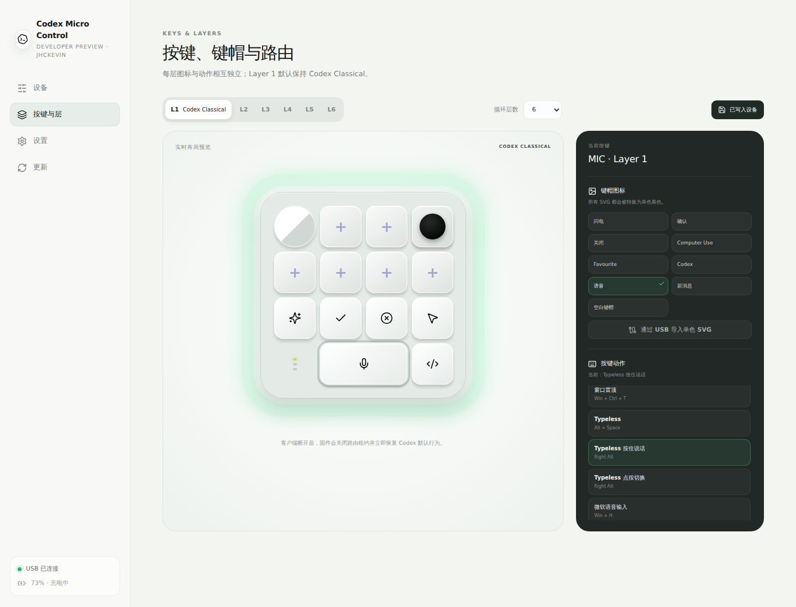

| 模板 | 按下 | 松开 | 适合 |
|---|---|---|---|
| Typeless | Alt + Space 预设动作 | 按动作引擎处理 | 用户软件配置成该快捷键 |
| Typeless 按住说话 | Right Alt keydown | Right Alt keyup | 持续按住录音，松开结束 |
| Typeless 点按切换 | 发送一次 Right Alt 按键脉冲 | 不再补一次切换脉冲 | 点一次开始，再点一次停止 |

选择模板后点击“写入设备”，再到 Typeless 自己的设置核对触发方式与键位。客户端按你的要求提供预设，不负责检测目标软件是否安装或自动替它改配置。模板与目标软件设置不一致时，键已经正确发送也可能看起来“没反应”。

做一个完整验证：按住 2～3秒、说一句短话、松开，看录音指示是否停止。点按模板则检查第二次点按能否结束。切回 Codex 使用时，把该键动作恢复为“Codex 原生”并写入；只把图标改回麦克风不够。

<a id="shortcuts"></a>
## 16. Desktop：快捷键、自定义组合和应用

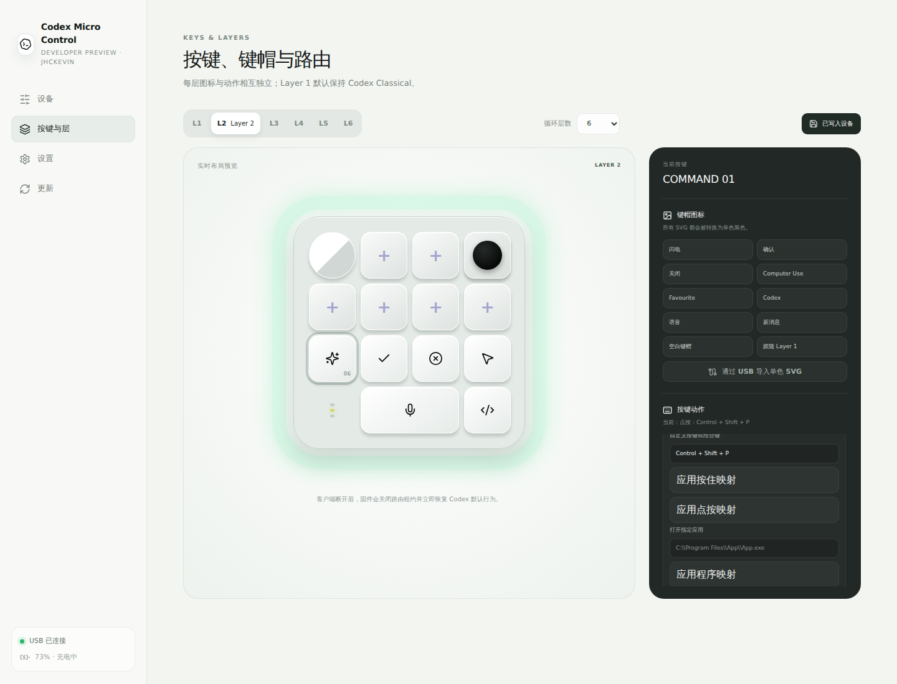

内置模板发送固定动作，目标软件是否处理它取决于系统、应用配置和当前焦点。以下是本仓库模板值，并不承诺 Windows 或第三方软件永远使用同一快捷键：

| 模板 | 当前输出 |
|---|---|
| 复制 / 粘贴 / 剪切 | Ctrl+C / Ctrl+V / Ctrl+X |
| Windows 键 | Win |
| Click to Do | Win+Q |
| 窗口置顶 | Win+Ctrl+T |
| Typeless | Alt+Space |
| 微软语音输入 | Win+H |
| 命令面板 | Win+Alt+Space |
| 打开 Codex / ChatGPT | 客户端应用前台动作，不是通用组合键 |
| Typeless 按住 / 点按 | 见上一章 Right Alt 规则 |

**自定义按键：**在“自定义按键或组合键”输入框填写键名，用加号分隔，例如 `Control + Shift + P`。当前校验允许 1～8 个支持的键名，包含 Control、Shift、Alt、RightAlt、Windows、Space、Enter、Tab、方向键、A～Z、0～9、F1～F24 等。此处使用 Control，不要直接把模板显示的 Ctrl 缩写照搬。

“应用按住映射”保留按下至释放的生命周期；“应用点按映射”发送一次按键脉冲，适合命令快捷键。改完仍要“写入设备”。测试 Ctrl+Shift+P 时，先让支持该命令的编辑器获得焦点，否则无可见反应并不能证明设备丢包。

**打开指定应用：**填写本机绝对 .exe 路径，点“应用程序映射”后写入，例如自己实际安装目录下的程序。当前输入框不是任意 shell 命令框，不应填写带管道、脚本片段或相对路径的命令。另一台电脑安装路径不同，需要重新配置。

<a id="icons"></a>
## 17. Desktop：键帽、单色 SVG 和内容包

右侧编辑器的“键帽图标”提供内置图标、空白键帽和高层“跟随 Layer 1”。选图只改显示，不改路由；“空白”只是没有图案，不等于禁用按键。高层选择跟随第一层后，第一层对应图标变化会影响继承显示；想独立使用就再选一个明确图标。


导入自定义 SVG 的操作：

1. 接原生 USB 并连接 Desktop，选中目标层、目标键。
2. 点击“通过 USB 导入单色 SVG”，选择本地 SVG 文件。
3. 客户端把 SVG 安全解析并栅格化成单色黑色图标，彩色输入也按单色处理。
4. 等待“已通过 USB 写入并应用”等确认，再写入整个层配置。
5. 回设备查看该键；换层和退出客户端时分别确认显示与动作。

新增像素内容需要 USB，BLE 日常管理不承载图标包安装。导入中不要拔线；出现解析错误时先使用简单路径、明确 viewBox、无外链的 SVG 检查。不能把外部脚本、网络图片或复杂 SVG 功能视作必然支持。

当前 Desktop 预览对部分自定义图标使用通用占位图，Agent 预览也可能保留“+”；因此页面预览不是自定义像素最终效果的唯一证据。应以内容写入结果和实机键帽显示为准。公开页面也并未提供完整的图标库批量管理工作台，协议内容包能力与已有可点击界面要区分。

<a id="desktop-settings"></a>
## 18. Desktop：全部设备设置与声音

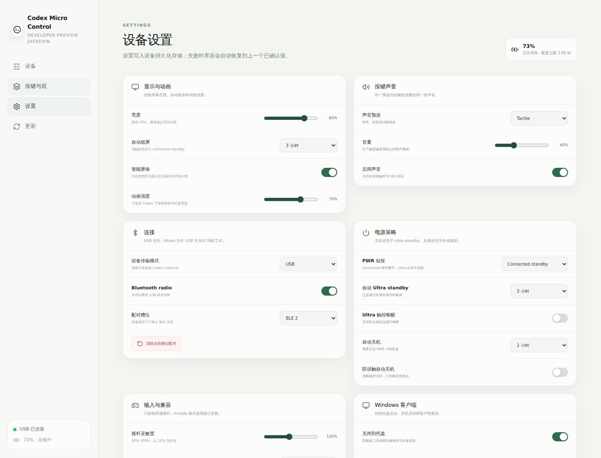

这页按卡片分组，修改设备设置会发送配置请求；失败时应回滚到上次已确认值。页面上的百分比、充电状态在截图里是模拟数据，实际读取依赖设备。

| 卡片 | 控件 | 影响范围 |
|---|---|---|
| 显示与动画 | 亮度、自动熄屏、智能屏保、动画强度 | 本地显示和计时；不改变 Codex 任务状态 |
| 按键声音 | Linear / Tactile / Clicky、音量、启用声音 | 机械键音效预设；层键保留独立擦声 |
| 连接 | Auto / USB / BLE / Mixed、Bluetooth radio、槽位、清除 | 实际传输与绑定；切换可能中断当前管理会话 |
| 电源策略 | PWR 短按、Auto Ultra、触控唤醒、自动关机、防误触关机 | 对应设备三页设置与电源状态机 |
| 输入与兼容 | 摇杆 50%–200%、协议档案 | 经典输入尺度与兼容解析选择 |
| Windows 客户端 | 关闭到托盘、开机启动、自动检查更新 | 只影响电脑端应用行为 |

声音预设是 Linear（线性）、Tactile（段落）、Clicky（清脆）三类。同一预设内键盘按键使用一致素材，按下与松开分开处理，左下层键另用擦声。更换预设后测试一个点按和一个长按；声音开启并不影响 Codex MIC 的电脑音频采集权限。

动画强度不是提升刷新率的开关。把它调高可能让变化更突出，但协议回复、输入响应和 LCD 刷新仍由固件运行状态决定。协议档案默认 Auto；Current、Legacy、Compatibility 留给明确的兼容排查，不应遇到所有故障都轮流切换。

充电栏可能在 USB 存在且未充电时显示“已充满”等简化文字。USB 存在本身不能证明满电：应同时检查百分比、充电标志、PMIC 状态。手册保留这一已知表述局限，不把 UI 文案当作传感器读数。

<a id="tray"></a>
## 19. Desktop：托盘、启动与退出

“关闭到托盘”开启时，点窗口 x 会隐藏主窗口，设备连接和动作映射仍运行；这是让自定义快捷键继续工作的常用方式。想真正结束映射，应使用退出应用，或在连接页主动断开。仅最小化窗口不会自动恢复经典路由。

“开机时启动”以后台模式运行，适合每天使用高级层。配置之前先完成一次手动启动、连接、映射验证，再启用自启动，否则会把未解决的连接问题带入每次登录。“自动检查客户端更新”是检查偏好；本公开源码没有配置公共发布源，因此打开它不等于有新版本可下载。

Portable 是免安装启动形式，不等于不写任何配置。安装版的卸载默认也不删除所有应用数据，重新安装可能保留旧设置。复制可执行文件到另一目录不能视作重置设备，固件设置、BLE 绑定和 Desktop 配置分别存储。

后台运行的意义是继续处理设备事件，而不是让渲染窗口永久全速刷新。若你怀疑后台仍耗用异常，查看任务管理器中的 Electron 与原生 helper 进程，再记录连接方式和是否有按键事件；不要凭窗口不见了判断程序已经结束。

<a id="updates"></a>
## 20. 热补丁、完整固件和客户端更新

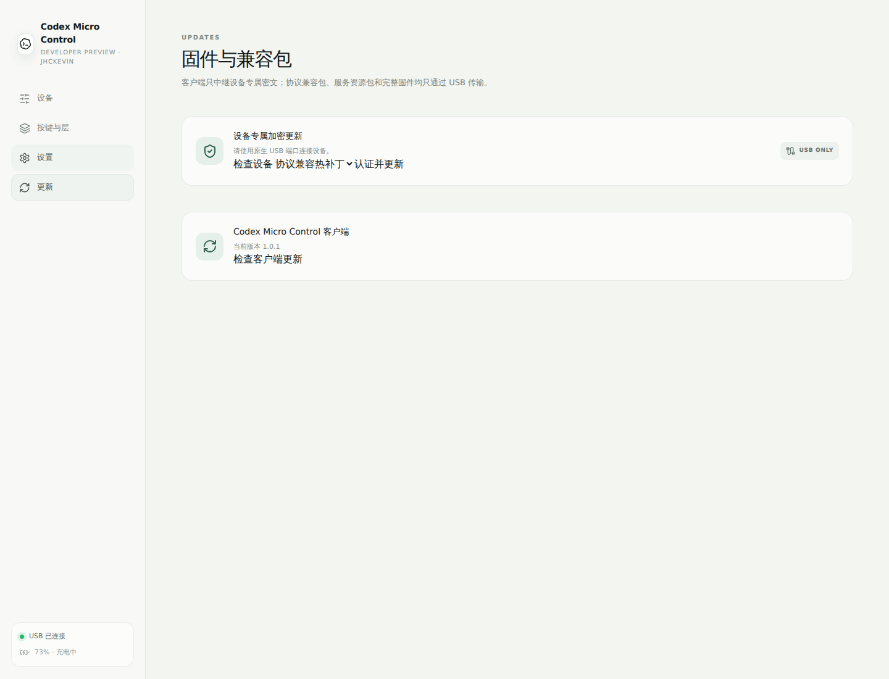

**本公开版本的重要边界：加密套件和默认私有更新鉴权已关闭，不提供公共固件服务或 Release。** 页面保留了早期设备专属更新流程的实现与文字，不能直接理解为公开版设备能够在此下载官方镜像。普通使用者更新本项目固件，走第 23 章自行编译与刷写路线。

| 页面类型 | 设计用途 | 当前公开版应如何理解 |
|---|---|---|
| 协议兼容热补丁 | 更新允许的协议兼容数据 | 不是任意执行 C++ 代码的注入器；需要匹配更新机制 |
| 服务与资源包 | 按包类型重新加载资源/服务 | 是否需要重载取决于实现和包，不保证所有内容无中断 |
| 完整固件 | 写入完整目标应用并重启激活 | 不等于 Desktop 内置串口刷机工具 |
| 签名键帽内容包 | 内容包验证和传输 | 与普通 SVG 导入入口有所区别 |
| 客户端更新 | 替换 Windows 应用 | 不会自动等同于更新设备 |

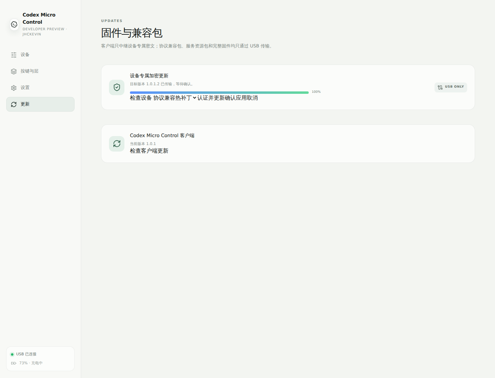

**Desktop QA 截图：**模拟的是“传输完成，等待确认”状态，并未下载真实加密镜像，也没有改任何设备。历史完整流程是检查设备、选择类型、获取包、USB 中继、设备验证、确认应用、回读版本。完整固件确认后重启，热包按自身机制应用；传输失败或验证失败不能跳过校验强行激活。

源码中的 `CODEX_MICRO_UPDATE_BASE_URL` 是服务地址配置入口，默认没有值；仅填一个 HTTPS 地址不会自动创建鉴权服务、制包服务或硬件密钥。Electron 打包配置也使用 `publish: null`，没有默认更新源。想二次开发这一套，需要部署匹配服务并解决包格式、兼容性和发行策略；不能把关闭的历史安全流程当成已配置产品服务。

本仓库默认禁止以“更新”为由烧写 eFuse；曾经写入芯片的 eFuse 不能通过换源码撤销。普通用户不需要为了安装图标开启 Secure Boot 或 Flash Encryption。

<a id="battery"></a>
## 21. 电池、电量、充电与续航

### 21.1 适配对象和参数来源

当前电池档案为 **606080、ATL A 类、3.7V、4000mAh / 14.8Wh、带保护板**。供货信息由用户提供，称电芯最大支持 4A、保护板最大支持 3A，作为选用该电池时的充电能力参考；这些值未经本项目独立验证，不等于可直接用于其他电池的额定参数。“精品/A类”也不是安全认证。

本项目软件充电上限仍是 **1.2A**。这套电池/保护板组合的宣称能力不适用于任意同容量电池，也不会扩大 AXP2101 和主板能力。更换电池之前确认单节体系、截止电压、极性、持续允许电流、保护板和连接器规格；更换后重新评估 `CODEX_CHARGE_MAX_MA`。

### 21.2 电量、充电状态、配置上限

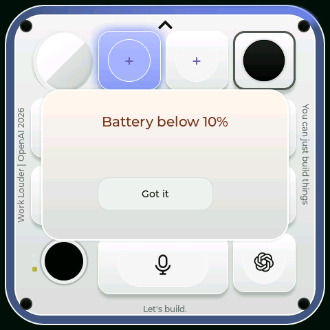

**LVGL 离屏截图：**低电量弹窗演示。设备在低于 10% 或曾有电池后检测到断开时显示告警，点 Got it / 知道了关闭，不处理最长约 600秒。告警不意味着主板一定坏了，应先检查接线和状态。

“有电池 100%”与“No battery 对外兼容 100%”不同。插 USB 只代表输入存在，电池可能已完成充电、正在恒压尾段、处于输入或温度约束，不能只凭线插着判断正在充电。

按 4.2V × 1.2A，电池侧理论峰值约 **5.04W**。界面显示的是配置上限或估计，不是实测充电功率；USB 功率计读数还包含设备运行耗电与转换损耗，也不能直接当成电池充电功率。现有集成没有独立电芯 NTC 反馈和可靠的实时电池电流测量，日志显示 1200mA 配置不代表一直实际吸收 1.2A。

### 21.3 自适应策略与充满时间

正常阶段根据供电稳定性升至上限；输入压降、限流、PMIC 热调节或异常会影响档位；低压预充与芯片恒压收尾依然保留。软件应尽量避免过早按电压强制降档，但这不是绕过保护或保证全程恒流。

4000mAh 从 10% 补到 100% 的理想容量差约 3600mAh，单以 1.2A 计算约 **3小时**；从 0% 计算约 3.33小时。真实还要考虑恒压尾段、输入预算、电池状态和设备负载。先前约 3.5～5.5小时只是规划估计，本项目没有完整实测曲线证明每块电池都达到该范围。

### 21.4 续航估算与使用建议

用电池标称能量除以**电池侧平均耗电功率**得到理想小时数：

| 假设电池侧平均功率 | 14.8Wh 的理想运行时间 |
|---|---|
| 0.25W | 约59小时 |
| 0.5W | 约30小时 |
| 1W | 约15小时 |
| 2W | 约7.4小时 |

这是计算例子，不是本机测得功耗。背光、RGB 显示、持续动画、无线与音频使常亮模式耗电明显；用 Smart screen、适当亮度、关闭不用的 BLE 或选择合适的 Ultra，通常比只改灯环颜色更直接。要求连接持续的待机，与断开后硬件休眠，必须分开测量，不能宣称同样达到十天。

电池选择、错误极性、挤压、短路和不当改装可能造成损坏或起火。按项目许可的适用范围提供无担保软件；不能承诺免责文字排除法律不能排除的责任。保护板、充电限流和免责声明都不能代替正确装配和电芯规格。

<a id="versions"></a>
## 22. 软件版本与工具环境

环境取自这份源码的依赖声明，不是“随便安装最新版”。首次构建使用独立目录和 ESP-IDF 自带 Python 环境，避免与其他工程的全局库混用。

| 工具/组件 | 版本 |
|---|---|
| ESP-IDF | 5.4.2，组件约束 >=5.4.2,<5.5 |
| LVGL | 9.2.0 |
| esp_lvgl_port | 2.7.2，仓库内补丁版本 |
| Waveshare BSP | 1.1.1，仓库内补丁版本 |
| Node.js | >=24，本次截图环境24.18.1 |
| React / Vite | 19.2.3 / 7.3.6 |
| Electron | 43.2.0 |
| TypeScript / Tailwind | 5.9.3 / 4.1.18 |
| electron-builder / wouter | 26.15.3 / 3.10.0 |
| Windows 原生构建 | Visual Studio C++ Build Tools 与 Windows SDK |

固件组件约束见 `firmware/main/idf_component.yml`，补丁在 `third_party/`。Desktop 使用 `package-lock.json` 与 `npm ci`。不要把本项目补丁目录换成同版本但未修改的上游包；版本号相同不代表补丁内容相同。

Windows 构建 Desktop 原生 helper 需要能够找到 cl.exe 的开发终端。Linux 可以跑纯 C++ 逻辑测试和网页截图，但不能据此宣布 Windows HID、键盘注入、安装器都通过。当前 macOS Desktop 不在适配范围。

<a id="firmware-build"></a>
## 23. 从源码构建、刷写与恢复固件

### 23.1 拉取并构建

按 [ESP-IDF 5.4.2 官方入门文档](https://docs.espressif.com/projects/esp-idf/en/v5.4.2/esp32s3/get-started/index.html)准备 ESP32-S3 工具链，进入已激活的 IDF 终端：

```sh
git clone https://github.com/jhckevin/codex-micro-waveshare.git
cd codex-micro-waveshare/firmware
idf.py --version
idf.py set-target esp32s3
idf.py build
idf.py size
```

第一次构建需要联网解析组件依赖。保留工程默认 Flash、PSRAM、分区和 BSP 配置，不复用其他板卡的 sdkconfig。若构建报告目标不匹配，先确认当前路径是 firmware，再核对 IDF 版本，而不是随意删掉组件约束。

### 23.2 刷写与日志

接 USB TO UART，在 Windows 设备管理器识别实际串口，替换下面的占位符：

```sh
idf.py -p YOUR_UART_PORT flash
idf.py -p YOUR_UART_PORT monitor
```

Windows 示例端口可能是 COM5；它只是示例。完整刷写使用这一次构建输出的 bootloader、分区表和 app 配套偏移，不应混用历史镜像。烧录完成退出 monitor 后，切到原生 USB 验证 Codex 数据路径。

如果自动下载失败，断电，按住 BOOT 再接回数据线，进入 ROM 下载后松开，重新识别端口再刷。不要把“重启按钮”与“BOOT 下载条件”混为一谈。遇到已烧安全 eFuse 的板卡，先核查真实状态；默认公开构建不烧 eFuse，但不能撤销芯片过去的写入。

### 23.3 逻辑测试与实机验证

```sh
bash tests/host/run-linux.sh
```

这个入口需要 g++，验证状态机和纯逻辑。它无法测物理背光、LCD 时序、电池温度和无线干扰。首次上板至少检查 BOOT 设置入口、PWR、MIC 按住/松开、三页切换、USB通信和无电池状态，再逐项启用 BLE、图标和高级路由。

<a id="desktop-build"></a>
## 24. 从源码运行和打包 Windows Desktop

在 Windows x64 的 C++ 开发终端中，准备 Node.js 24 和 Windows SDK：

```powershell
cd codex-micro-waveshare/desktop
npm ci
powershell -ExecutionPolicy Bypass -File native/build.ps1
npm test
npm run build
npm run dist:win
```

原生 helper 构建负责 Windows 输入和 BLE 支持，不能仅复制浏览器 dist 文件就认为得到了完整桌面客户端。安装包和 portable 由最后一步在自己的环境产生；本项目不把它们上传 Release。没有代码签名证书的自行构建程序可能触发系统信誉提示，应自行检查构建来源和文件内容。

仅预览前端，可在 desktop 目录执行 `npx vite --host 127.0.0.1`，打开 `/?qa=device#/`。QA 模拟设备会提供样例电量和更新流程，适合学习界面；它不会控制真实板卡或实际向 Windows 注入快捷键。不要把 QA 构建当正式硬件客户端分发。

打包配置使用 asar、限制 Electron 特性并附带 native helpers。安装版默认按用户安装，portable 独立启动，配置仍可能存入用户数据目录。发布源默认为空，自己生成包后不会自动获得公共升级服务。

<a id="parts"></a>
## 25. 底座零件清单与选型

底座用于隐藏电池、整理线材，并提供约 21° 倾斜视角。它不是独立电子扩展板，也没有额外按键或充电功能。先用原机验证固件，再装底座，能够避免把接线问题与软件问题混在一起。


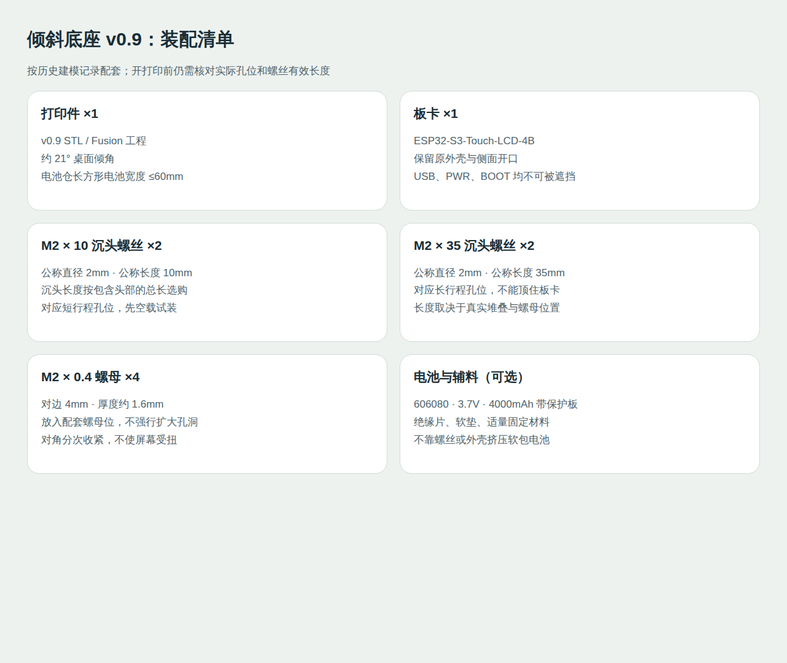

| 项目 | 数量 | 选型与注意事项 |
|---|---:|---|
| ESP32-S3-Touch-LCD-4B | 1 | 完整型号必须匹配 |
| v0.9 底座打印件 | 1 | 使用本章配套 STL，先看切片预览 |
| M2×10 沉头螺丝 | 2 | 公称直径2mm，沉头总长10mm |
| M2×35 沉头螺丝 | 2 | 沉头总长35mm，核对实际长行程孔位 |
| M2×0.4 六角螺母 | 4 | 对边4mm，厚约1.6mm；核对螺母槽 |
| 4000mAh 电池 | 可选1 | 606080，单节3.7V，带合适保护板 |
| 绝缘片与软垫 | 按需 | 不妨碍散热，不压排线或软包 |
| Type-C 数据线 | 1或2 | 日常一根；刷写/诊断可两根 |
| 卡尺、螺丝刀、修边工具 | 各按需 | 先测量再收紧，不靠蛮力压合 |

螺丝组合来自当前建模记录。短/长螺丝对应不同的实际装配厚度，不要仅按照片猜左右；先空载穿入，确认螺纹进入螺母后不会继续顶住 PCB 或电池。沉头螺丝的公称长度包含头部，购买时不要用圆柱头/盘头的长度习惯直接换算。切片和打印误差可能使同一公称尺寸配合不同。

下载：[v0.9 STL](../hardware/print-files/Waveshare_86_21deg_v0.9_CODEX_FITCHECK.stl) · [Fusion 360 工程](../hardware/models/Waveshare_86_21deg_v0.9_CODEX_DRAFT.f3d)。DRAFT / FITCHECK 是保留的历史文件名，本次明确公开的是这两个 v0.9 文件；文件哈希见 [hardware 说明](../hardware/README.md)。

<a id="assembly"></a>
## 26. 打印、试装、布线与装配


内部四角结构用于定位紧固，电池放在净空区域，线材不要跨过螺柱和合拢边缘。**长方形电池宽度不得超过60mm**；这只是一个限制，厚度、长度、保护板突出、引线弯曲和软包膨胀仍要预留空间。不能仅凭“606080”名称保证实物含保护板后的总尺寸完全一致。


底部孔位和标记见实物图。照片用于观察外观，尺寸以模型和实测为准。先用 PLA 或 PETG 做试装，建议0.20mm层高、至少3道墙和4～5底层作为起点；这不是每台打印机都必须照抄的最终切片参数。查看悬垂、螺母槽和螺柱支撑，检查孔径是否需要打印机公差补偿。


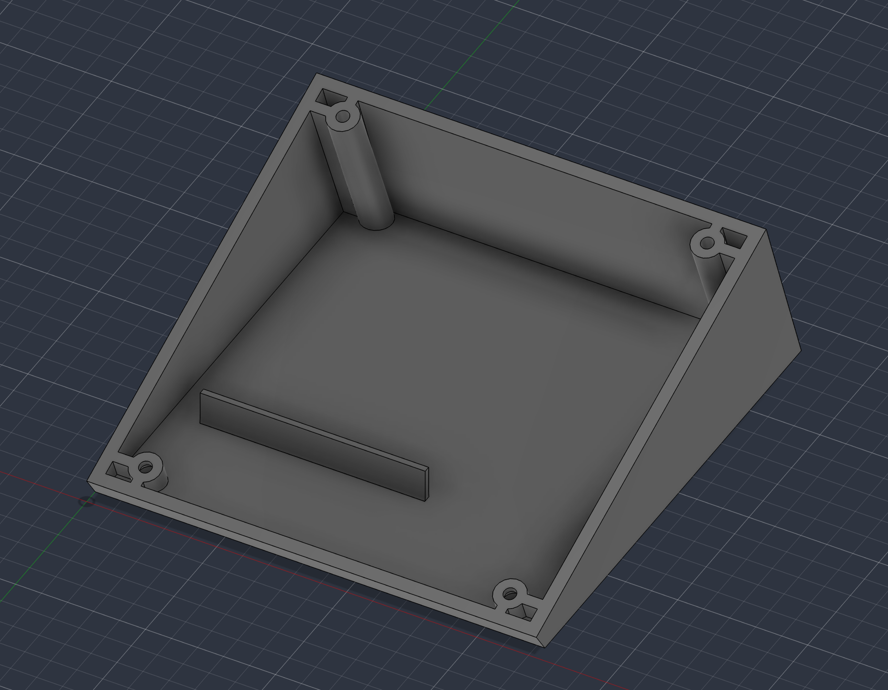

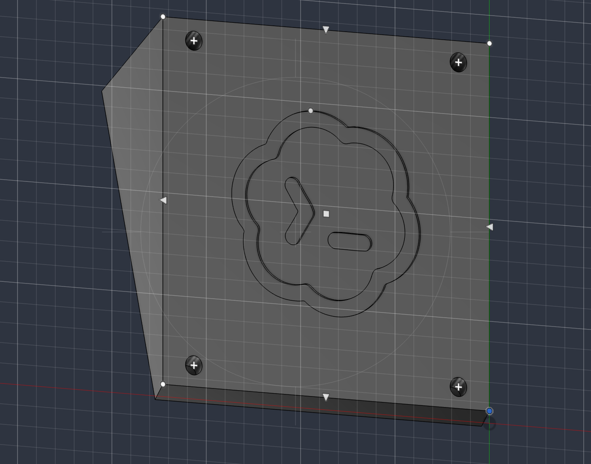

装配顺序：

1. 断开 USB 与电池，去除支撑和毛刺，检查孔、槽、薄壁。
2. 不放电池，先把板卡和底座空载组合，试放螺母和两种长度的螺丝。
3. 检查 USB 两口、PWR、BOOT 和 CHG LED 的开口，确认手指可操作、插头可完全插入。
4. 用卡尺检查电池含保护板与引线的实际包络，加绝缘与适当软垫。
5. 接线前核对 PH2.0 正负极；整理线材，避免夹在螺柱、边框和背盖之间。
6. 对角分次拧紧，只达到可靠固定，不把屏幕或软包作为承力垫。
7. 接 USB 启动，查看电池存在、电压与充电状态，轻按侧键检查有无机械卡住。
8. 使用一段时间后检查线材受力、壳体变形和电池空间；有异常立即断电检查。

更大容量电池可能放得下，但充电时间通常更长，原4000mAh估算也随之失效。底座不能保证任意电池/打印材料组合安全，修改模型后应重新验证机械和电气条件。

<a id="troubleshooting"></a>
## 27. 故障排查与验证边界

遇到问题先记下“发生前正在做什么”，然后只改变一个条件。反复清配对、换模式、换线和刷固件，会把原问题的证据混在一起。

| 现象 | 先检查 | 下一步 |
|---|---|---|
| 屏幕亮，但电脑不识别 | 线是否支持数据；接的哪个 USB 口 | 单根已知数据线接原生 USB，查系统枚举 |
| UART 有日志，Codex没反应 | 日常线是否只接了 UART | 改接原生 USB |
| Windows已连接，Codex红字 | 当前槽、协议状态、App版本 | 记录中断提示，检查实际 HID/RPC |
| BLE换槽后找不到电脑 | 目标电脑是否在该槽配过对 | 先恢复正确槽，必要时两端删除旧绑定 |
| MIC 松开后仍录音 | 当前路由、模板、宿主录音模式 | 先恢复 Codex 原生或正确 RightAlt 模板再试 |
| 图标改了动作没变 | 是否另选动作、写入成功、Desktop常驻 | 检查路由租约与目标软件焦点 |
| 自定义SVG预览是占位图 | 导入是否成功，预览支持范围 | 看实机图标，不将占位图当传输失败 |
| Screen时间到了还亮 | Smart screen是否开，灯是否仍亮 | 看连续暗灯时间，不只看触摸空闲 |
| Auto Ultra不触发 | USB挂载、任务灯、按键、录音、保护期 | 满足条件再检查计时 |
| Standby有微光 | 暗室观察与侧LED反光 | 记录进入方式、供电和亮度；未完成零发光验收 |
| 电量一直100% | 是否实际无电池、宿主缓存 | 比较设备No battery/电压/存在位 |
| USB插着但不充电 | PMIC状态、满电/受限情况 | 不凭USB或CHG灯单独下结论 |
| 更新页认证失败 | 公开版安全流程默认关闭 | 自编译刷写，或完整开发匹配的更新服务 |
| 底角黑块/闪烁 | 是否物理刷新问题 | 拍实物现象、记录固件和负载；帧缓冲正常不能排除 |

本次文档截图能验证控件位置、部分操作状态与网页渲染，不是新一轮整机稳定性验收。当前明确未宣称完成：macOS实机、所有BLE多机组合、暗室完全零背光、每块电池完整充电曲线、所有显示负载下的长期无撕裂、公共更新服务开箱即用。

提交问题时提供：板卡型号/批次、固件提交与设置版本、Codex App版本、Windows版本、线接在哪个口、是否有电池、当前模式/槽位、复现步骤。日志先脱敏，避免上传绑定密钥、私有服务器凭据或无关个人内容。开发 HIL 入口只用于受控诊断，正式分发构建按实际配置关闭。

<a id="extend"></a>
## 28. 扩展玩法、截图复现与许可

可以从一个低风险的二层配置开始：Layer1保持Codex，Layer2放复制、粘贴、命令面板、窗口置顶与Typeless。直播或剪辑可以增加场景层，游戏输入可以从Arcade控制方式借鉴，图标包可以做成单色应用符号。新增玩法始终保留MIC松开、失联经典回退和独立Codex外环控制。

本手册截图工具放在 [docs/render](render/README.md)。LVGL程序直接编译固件UI及素材，提供可重现的模拟DeviceState；Desktop脚本操作QA页面；侧键、接口、BOM和路由图是独立HTML示意图的截图。运行与依赖见该目录说明。生成图片是PNG，说明性布局有HTML源，可随源码更新重新采集。

当前公开构建关闭Secure Boot、Flash Encryption、设备唯一绑定和默认私有更新鉴权；不主动烧写eFuse。历史上已经烧写的安全位不受源码开关逆转。仓库采用[混合许可](../LICENSE)：新增独立原创内容适用PolyForm Noncommercial，上游和历史已授予的MIT权限保留，第三方素材遵循其原权利。源码公开允许学习和相应许可范围内的修改，不等于提供全部商业使用许可。

继续查阅：[项目README](../README.md) · [微雪官方Wiki](https://www.waveshare.net/wiki/ESP32-S3-Touch-LCD-4B) · [硬件装配目录](../hardware/README.md) · [Desktop独立项目](../desktop/README.source.md)。
